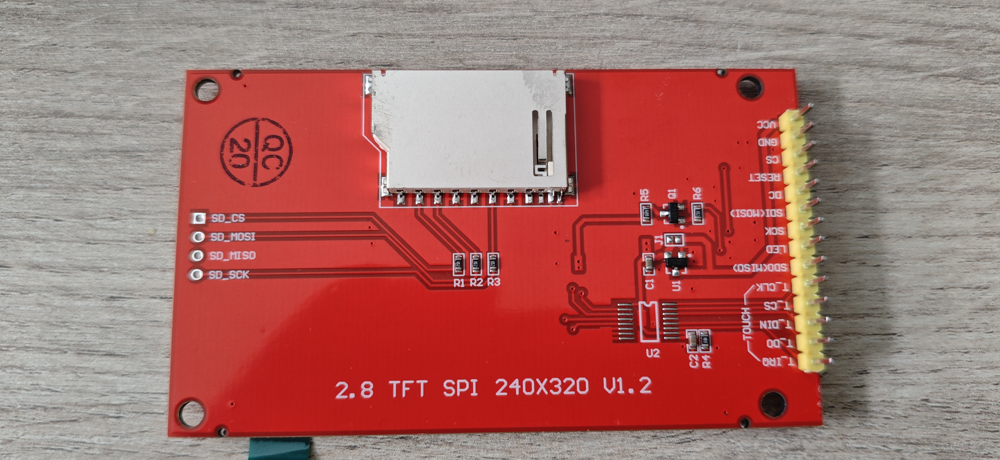
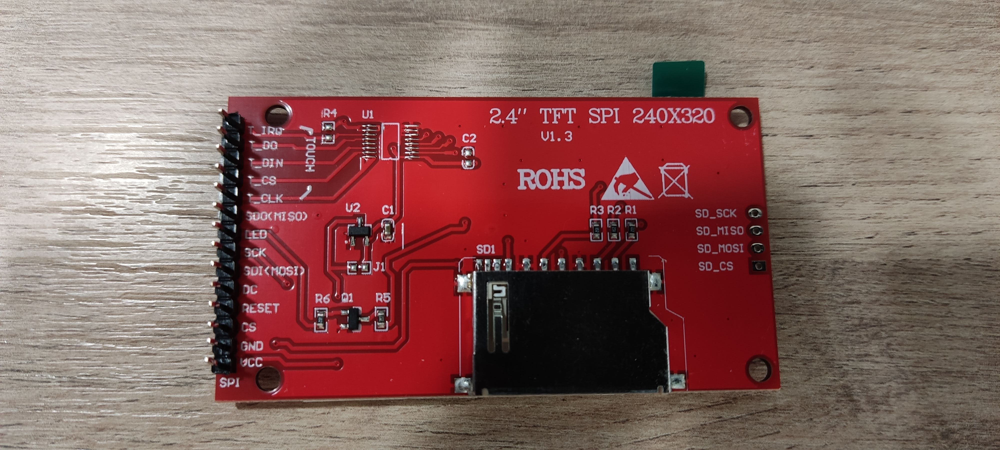

# ESP8266 Weather Station 🌤️

🇧🇬 [Прочети на български](README.bg.md)

A compact ESP8266-based weather station with a 2.4" TFT display showing indoor/outdoor temperature, humidity, pressure, a 3-day weather forecast, and today's detailed forecast split into 6-hour blocks.

## Features

- 📊 **Dual readings**: Indoor (AHT20 sensor) and outdoor (fetched from remote station)
- 🌡️ Temperature, humidity, and pressure display with trend indicators
- 📅 3-day weather forecast from Open-Meteo API
- 🕐 Today's forecast in 4 six-hour blocks (00-06, 06-12, 12-18, 18-24) with icons, temperature range, precipitation, and wind
- 🔄 Three-screen rotation: main → 3-day forecast → main → today's forecast
- 🕐 NTP time synchronization with timezone support
- 📶 WiFi auto-reconnect

## Hardware Requirements

| Component | Description |
|-----------|-------------|
| NodeMCU v3 | ESP8266 development board |
| ILI9341 or ST7789 | 2.4" TFT LCD display (240x320, SPI) |
| AHT20 | Temperature & humidity sensor (I2C) |

### Wiring Diagram


<details>
<summary>📐 Click to view schematic</summary>


</details>

> 💡 Fritzing project file: [home weather station.fzz](docs/home%20weather%20station.fzz)

#### Pin Connections

**TFT Display (ILI9341 / ST7789) → NodeMCU:**

| Display Pin | NodeMCU Pin | GPIO |
|-------------|-------------|------|
| VCC | 3V3 | - |
| GND | GND | - |
| CS | D8 | GPIO15 |
| RESET | D3 | GPIO0 |
| DC | D4 | GPIO2 |
| SDI (MOSI) | D7 | GPIO13 |
| SCK | D5 | GPIO14 |
| LED | 3V3 | - |

**AHT20 Sensor → NodeMCU:**

| Sensor Pin | NodeMCU Pin | GPIO |
|------------|-------------|------|
| VCC | 3V3 | - |
| GND | GND | - |
| SDA | D2 | GPIO4 |
| SCL | D1 | GPIO5 |

## Installation

### Prerequisites

- [VS Code](https://code.visualstudio.com/) with [PlatformIO extension](https://platformio.org/install/ide?install=vscode)
- Or standalone [PlatformIO CLI](https://docs.platformio.org/en/latest/core/installation.html)

### Steps

1. **Clone the repository:**
   ```bash
   git clone https://github.com/NTsvetkov/home-weather-station.git
   cd home-weather-station
   ```

2. **Create your configuration file:**
   ```bash
   cp src/config.example.h src/config.h
   ```

3. **Edit `src/config.h`** with your settings:
   ```cpp
   #define WIFI_SSID "your-wifi-name"
   #define WIFI_PASS "your-wifi-password"
   ```

4. **Build and upload** (default: ST7789):
   ```bash
   pio run -t upload
   ```
   For ILI9341, build the corresponding environment:
   ```bash
   pio run -e nodemcuv2_ili9341 -t upload
   ```

5. **Monitor serial output (optional):**
   ```bash
   pio device monitor
   ```

## Configuration

All settings are in `src/config.h`. Key options:

| Setting | Default | Description |
|---------|---------|-------------|
| `WIFI_SSID` | - | Your WiFi network name |
| `WIFI_PASS` | - | Your WiFi password |
| `TZ_INFO` | `EET-2EEST...` | Timezone (POSIX format) |
| `TREND_WINDOW_MINUTES` | 30 | Minutes for trend calculation |
| `CFG_MAIN_SCREEN_DURATION_MS` | 10000 | Main screen display time (ms) |
| `CFG_FORECAST_SCREEN_DURATION_MS` | 10000 | Forecast screen display time (ms) |
| `CFG_TODAY_SCREEN_DURATION_MS` | 10000 | Today's forecast screen display time (ms) |
| `CFG_GAUGE_FETCH_INTERVAL_MS` | 180000 | Outdoor data refresh (3 min) |
| `CFG_FORECAST_FETCH_INTERVAL_MS` | 3600000 | Forecast refresh (1 hour) |

### Display Driver

The project supports both **ILI9341** and **ST7789** TFT displays. Two PlatformIO environments are defined in `platformio.ini`:

| Environment | Display | Build flag |
|-------------|---------|------------|
| `nodemcuv2_st7789` (default) | ST7789 | `-DDISPLAY_ST7789` |
| `nodemcuv2_ili9341` | ILI9341 | `-DDISPLAY_ILI9341` |

To switch displays, change `default_envs` in `platformio.ini`:
```ini
[platformio]
default_envs = nodemcuv2_ili9341
```
Or build a specific environment directly:
```bash
pio run -e nodemcuv2_ili9341
```

The abstraction lives in `src/display_config.h` which conditionally includes the correct driver library, defines a `TftDriver` typedef, and provides unified `CLR_*` color constants.

#### Hardware versions

| | v1.2 (ILI9341) | v1.3 (ST7789) |
|-|----------------|---------------|
| Size | 2.8" | 2.4" |
| Resolution | 240×320 | 240×320 |
| SD card slot | Yes | No |
| Wiring | identical | identical |
| PlatformIO env | `nodemcuv2_ili9341` | `nodemcuv2_st7789` |

| v1.2 — ILI9341 | v1.3 — ST7789 |
|----------------|---------------|
|  |  |

Both boards use the same SPI wiring — no rewiring needed when switching between them.

### Cyrillic Font Patch

The standard Adafruit GFX font (`glcdfont.c`) does not contain Cyrillic characters. A PlatformIO pre-build script (`scripts/patch_font.py`) automatically patches the font with Cyrillic glyphs (Windows-1251 layout: A-я, Ё, ё) before each compilation. No manual steps are needed — the patch runs transparently and skips if already applied.

### Data Sources

#### Outdoor Readings
Current outdoor temperature, humidity, and pressure are fetched from [meter.ac](https://meter.ac/) - a network of weather stations in Bulgaria. The default configuration uses data from **Pazardzhik**.

#### Weather Forecast
The 3-day forecast comes from [Open-Meteo](https://open-meteo.com/) using the **ECMWF IFS HRES** model (9km resolution). No API key required!

Today's 6-hour forecast uses a separate hourly endpoint (`forecast_days=1`) from the same API, aggregating 24 hourly values into 4 blocks.

You can customize the forecast location using the [Open-Meteo API builder](https://open-meteo.com/en/docs).

#### Forecast Icons Logic
Icons are generated based on multiple parameters (not just WMO weather codes):

| Condition | Icon |
|-----------|------|
| WMO code 95, 96, 99 | ⛈️ Storm |
| Precipitation ≥ 10mm | ❄️ Snow (if tMax ≤ 2°C) or 🌧️ Heavy rain |
| Precipitation ≥ 0.2mm | ❄️ Snow (if tMax ≤ 2°C) or 🌦️ Rain |
| Cloud cover < 25% | ☀️ Sunny |
| Cloud cover < 70% | ⛅ Partly cloudy |
| Cloud cover ≥ 70% | ☁️ Cloudy |

## Project Structure

```
├── src/
│   ├── main.cpp            # Main application logic
│   ├── config.h            # Your configuration (gitignored)
│   ├── config.example.h    # Configuration template
│   ├── display_config.h    # Display driver abstraction (ILI9341/ST7789)
│   ├── display.cpp/h       # TFT rendering functions
│   ├── data.cpp/h          # Data structures and fetching
│   ├── sensors.cpp/h       # AHT20 sensor handling
│   └── utils.cpp/h         # Helper functions
├── scripts/
│   └── patch_font.py       # Pre-build Cyrillic font patcher
├── docs/                   # Documentation & images
└── platformio.ini          # PlatformIO configuration
```

## Dependencies

Managed automatically by PlatformIO:

- [Adafruit GFX Library](https://github.com/adafruit/Adafruit-GFX-Library)
- [Adafruit ST7735 and ST7789](https://github.com/adafruit/Adafruit-ST7735-Library) (ST7789 environment)
- [Adafruit ILI9341](https://github.com/adafruit/Adafruit_ILI9341) (ILI9341 environment)
- [Adafruit AHTX0](https://github.com/adafruit/Adafruit_AHTX0)
- [ArduinoJson](https://github.com/bblanchon/ArduinoJson)

## Troubleshooting

| Issue | Solution |
|-------|----------|
| Display is white/blank | Check wiring, especially CS, DC, RST pins |
| No WiFi connection | Verify SSID/password in config.h |
| "No data" on screen | Check internet connection; outdoor source may be down |
| Sensor readings wrong | Verify I2C wiring (SDA→D2, SCL→D1) |

## License

MIT License - see [LICENSE](LICENSE) for details.

## Contributing

Pull requests are welcome! Please read the existing code style and test your changes before submitting.

## Acknowledgments

> 🤖 **Disclosure:** This is largely a vibe-coded project. I came up with the initial idea and a basic working prototype. Then various AI assistants (GitHub Copilot, Claude) generated most of the code while I provided guidance, code reviews, and uttered some choice words during debugging sessions. Human contribution: ~15-20%.

---

Made with ❤️ in Bulgaria 🇧🇬
